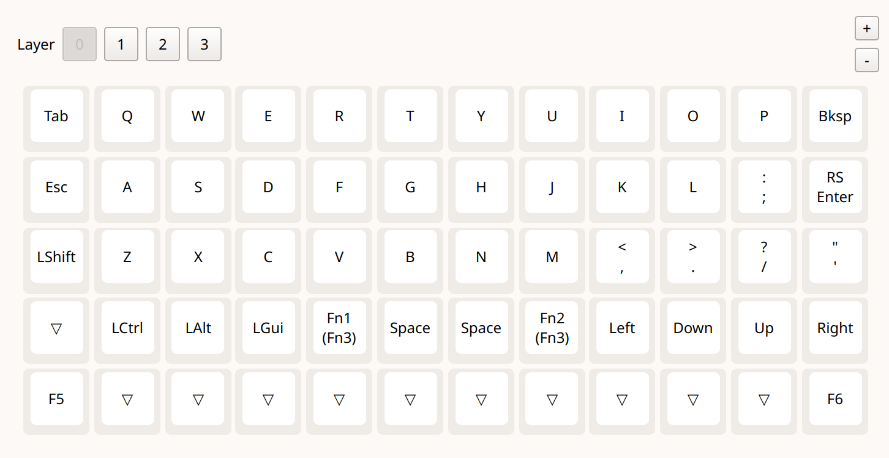
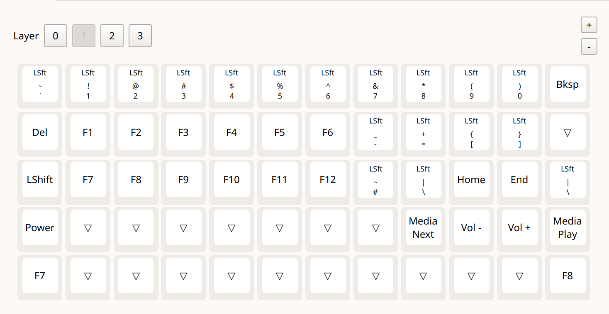

# Update Keyboard through Vial

I recommend taking out the SD card to ensure that the SD card does not accidently get corrupted. The left knob button should be assigned to <f5> and the right knob should be assigned to <f6>.

The picture below shows what my Vial configuration looks like as reference.


!

# Installation Guide

This is a step by step installation guide from scratch.

## Step 1: Initial Boot

I etch Raspberry Pi OS Lite 32-bit onto an SD card. The version I am using is `2024-11-19*`. I chose lite because I don't want a full desktop environment; 32-bit was chosen because it uses less RAM.

I used the `Disks` utility on Linux Mint Mate, but you should etch it using the software for your OS. 

There are several things that are important to do before we unmount the microsd card and put it into the MicroJournal.

We need to rotate the monitor. 

Before closing, you need to go to `/boot/cmdline.txt` and add the following to the beginning:

```sh
video=HDMI-A-1:400x1280M@60,rotate=90 
```

When you first boot up the OS, there will be some gooblygook. Then it will restart and boot. Then it will go through configuration. First for Keyboard. I chose English (US). My username and password is `oftendeck`. I will use that for file configurations from now on. Change it to your own if you used a different username and password.

Then, I edited some of the configurations:

```sh
sudo raspi-config
```

Then I did the following configurations:
> System Options > Boot / Auto Login > Console Autologin
> System Options > Wireless LAN > US United States > Type in Wifi Name > Type in Wifi Password

Once you set in your configurations, it will ask you to boot again.

Because of the small text, I adjusted the font of TTY again.

```sh
sudo dpkg-reconfigure console-setup
```

I set my font even larger to utf-8, guess optimal, Terminal Bold, 16x32.

This is a good time to take a break. To shut down the device, type:

```sh
shutdown now
```

Remember to click the off button switch to not drain the battery (if you are using battery).

## Step 2: Install `image-utils`

`image-utils` is a way to make image  backups for Raspberry Pi. This is both for you and for me. 

For you:
Like of using `dd`, this will make an `.img`file, but this will be much smaller. `dd` just copied the whole disk while `image-utils` copies the files. So my 128gb SD card containing 3gb of data using `dd` would be a 128gb large. Using `image-utils` would be 3gb large. Additionally,`image-utils` can be used within the Raspberry Pi OS instead of doing it externally and unmounted like `dd`.

For me:
I can make bootable images to share to you on GitHub

The folder we are going to save the backups in is `/mnt/backups`

```sh
sudo mkdir /mnt/backups
```

### Install `image-utils`

Clone the Repository

```sh
$ sudo apt update && sudo apt upgrade -y && sudo apt autoremove -y
$ sudo apt install git -y
$ cd && pwd
/home/pi
$ git clone https://github.com/seamusdemora/RonR-RPi-image-utils.git
```

### Staging & Usage

Install.

```
$ cd
$ sudo install --mode=755 ~/RonR-RPi-image-utils/image-* /usr/local/sbin
```

Now run and make a backup.

```
$ sudo image-backup

Image file to create? /mnt/Backup/oftendeck_backup.img

Initial image file ROOT filesystem size (MB) [3007]? 3500

Added space for incremental updates after shrinking (MB) [0]? 200

Create /mnt/Backup/oftendeck_backup.img (y/n)?y
```

This will take a few minutes. 

Update an existing .img backup:
Updating the image file is even easier:

```
$ sudo image-backup /mnt/Backup/oftendeck_backup.img
```

Then, go through the prompts. When it prompts you where to save the file, I put in `/mnt/backup/oftenzhan.img

Afterwards, I run it through `image-shrink` to shrink the .img to make it fit in an smaller SD cards.

To make the root partition fit the entire SD card, use the sudo raspi-config settings to expand the partition to fit the entire SD card. 

## Step 3: Install Dufs
This makes it easier to upload scripts.

1. Install Rust

In order to install `Dufs`, Rust and Cargo need to be installed. 

```
curl --proto '=https' --tlsv1.2 -sSf https://sh.rustup.rs | sh
```

```
. "$HOME/.cargo/env
```
2. Install Dufs

Afterwards, Dufs is installed using cargo.

```
cargo install dufs
```

This takes a long time because it is compiling it. It takes around an hour.

3. Run Dufs

Do a test run with Dufs by running

```
dufs -A
```

4. Edit the html and CSS

Dufs is very barebones but that is what makes it work very well. You can change the look and feel of it by changing the assets. They should be put in the assets folder and link it when running Dufs by typing in terminal:

```
dufs -A --assets ~/microjournal/.config/Dufs/assets
```

The folder needs to have a 
- index.css
- index.js
- index.html
- favicon.iso


# Install Syncthing

To install Syncthing on your Raspberry Pi and configure it for Wi-Fi access, follow these steps:

1. Install Syncthing:

```
sudo apt install syncthing
```

Run syncthing to make it generate a `.config.xml` file. Once it is fully loaded (it takes less than a minute) close it by typing: `C-c`.

2. Configure Syncthing for Wi-Fi Access:

By default, Syncthing's web GUI is accessible only from the Raspberry Pi itself. To allow access over Wi-Fi, modify the GUI's listen address.

Open the Syncthing configuration file:

```
nano ~/.config/syncthing/config.xml
```

Locate the <gui> section and change the <address> to `0.0.0.0:8384`:

```
<gui enabled="true" tls="false">
    <address>0.0.0.0:8384</address>
```
Save and close the file (press <kbd>Ctrl+X</kbd>, then <kbd>Y</kbd>, and Enter).

# Install Emacs

## Installation of Emacs
Since there is no gui, just install Emacs (no X). Since we also will eventually want spellcheck (hunspell), I've included an installation of that too.

```
sudo apt-get install emacs-nox hunspell hunspell-en-us
```

## Install custom `init.el`

Copy and paste the init.el file from this GitHub into `~/.emacs/init.el`.

There shouldn't be a file there. If there is, delete it and replace it with this file.

Once the `init.el` file is placed in the proper folder, there will be an error because certain packages are not installed. Install these packages one by one by using the command `M-x package-install`

```
bind-key
imenu-list
dired-sidebar
markdown-mode
yasnippet
evil
```

## Link `sudo emacs` with `emacs`

When you run `sudo emacs`, Emacs uses the **root user's config** instead of your own.  
If you want both your normal user and root to use the same configuration, you can **symlink** your config folder.

### Step 1: Remove Root’s Existing Emacs Config

First, clear out any existing config for the root user.

```bash
sudo rm -rf /root/.emacs.d
sudo rm -f /root/.emacs
```

### Step 2: Create a Symbolic Link

Now create a symlink from your user config to root’s config location.

Replace /home/yourusername/ with your actual username path:

```bash
sudo ln -s /home/yourusername/.emacs.d /root/.emacs.d
```

# Install Configuration Whiptail

Put all of the files in /navigation in `/usr/local/bin/`

make executable by typing

```
chmod +x often-*
```


# Configure tty1 and tty2

## tty2

### 1. Enable Auto-login on TTY2

Create an override for getty@tty2.service:

sudo systemctl edit getty@tty2

Add the following:

```
[Service]
ExecStart=
ExecStart=-/sbin/agetty --autologin oftendeck --noclear %I $TERM
```

(Replace `oftendeck` with your username if different.)

Then reload the daemon:

```
sudo systemctl daemon-reexec
sudo systemctl restart getty@tty2
```

### 2. tty2 Custom Autostart Script

Create a new file:

```
sudo nano /etc/profile.d/tty2-startup.sh
```

Add this:

```
#!/bin/bash

# Only run on TTY2
if [ "$(tty)" = "/dev/tty2" ]; then
    # Set custom font
    setfont /usr/share/consolefonts/Lat15-TerminusBold20x10.psf.gz

    # Launch raspi-config
    sudo raspi-config
fi
```

Make it executable:

```
sudo chmod +x /etc/profile.d/tty2-startup.sh
```

### tty1

```
sudo nano /etc/profile.d/tty1-startup.sh
```

```
#!/bin/bash

# Only run this if we're on tty1
if [[ "$(tty)" == "/dev/tty1" ]]; then
  exec emacs
fi
```

```
sudo chmod +x /etc/profile.d/tty1-startup.sh

```

# Installing `fbterm` and `fbi`

Instead of using an X-11 GUI, The terminal can be opened up with much more colors and font choices using the framebuffe, `fbterm`. One of the usefulnesses of using the framebuffer is that images and documents can be opened without opening X-11. For example, having the Apple logo and the windows logo during the beginning of boot up is used directly from the framebuffer. This allows us to be able to preview latex documents and generate PDFs prior to printing for markdown.  Viewing pictures and documents using an app called Frame Buffer Image, `fbi`, and FBI improved (fim)

```shell
sudo apt install fbterm fbi fim
```

I like Terminus Bold, so I have to install the `.ttf` file for the framebuffer instead of using the Linux Console `.psf.gz` format.

```shell
sudo apt install xfonts-terminus
```

Now, I have to fix the .fbtermrc first you have to generate it and then edit.

```shell
fbterm
```

then press `ctrl+d`

Then you edit the .fbtermrc

```
emacs ~/.fbtermrc
```

In it, there are three lines that need to be edited:

```
font-names=Terminus:style=Bold
```

```
font-size=40
```

```
screen-rotate=3
```

# Install Bluetooth keyboard 

While I like using the MicroJournal rev 2 revamp on the go, when I'm using it at home, I prefer to use a Bluetooth keyboard because it is better for ergonomics. I can put the screen farther away and raise it up so that's eye level.

I am using the keycron q15 Max because it has two knobs.

One thing that's very important is to set it to the window setting because the MAC address changes every time using the Macintosh setting.

1. Turn off Battery Saving Mode

`Main Menu > Battery Mode > Battery Saving Mode Off`

2. Scan for devices

First, launch the Bluetooth control tool:

```
bluetoothctl
```

Inside the prompt, turn on the agent and set it to default:

```
power on
agent on
default-agent
scan on
```

Now put your Bluetooth keyboard in pairing mode. You should see it appear like this:

```
[NEW] Device XX:XX:XX:XX:XX:XX Your-Keyboard-Name
```

3. Pair and trust the keyboard

Copy the device MAC address (XX:XX:XX:XX:XX:XX) and type the address. if you press tab after the first few letters, it will autocomplete it for you.

```
pair XX:XX:XX:XX:XX:XX
trust XX:XX:XX:XX:XX:XX
connect XX:XX:XX:XX:XX:XX
```

5. Save and exit

```
quit
```

It should not connect every time every single time you turn off battery saving mode.

# Print Preview

To make print preview work, first you have to make a script. I used a modified stripped down version of `fbgs` but instead of using `fbi`, it uses `fim`. I removed all the flags.


